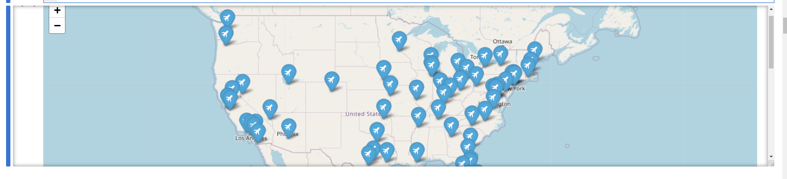

```python

```

\begin{center}
\begin{huge}
MCIS6273 Data Mining (Prof. Maull) / Spring 2024 / HW1
\end{huge}
\end{center}

| Points <br/>Possible | Due Date | Time Commitment <br/>(estimated) |
|:---------------:|:--------:|:---------------:|
| 20 | Wednesday February 28 @ Midnight | _up to_ 20 hours |


* **GRADING:** Grading will be aligned with the completeness of the objectives.

* **INDEPENDENT WORK:** Copying, cheating, plagiarism  and academic dishonesty _are not tolerated_ by University or course policy.  Please see the syllabus for the full departmental and University statement on the academic code of honor.

## OBJECTIVES
* Perfom basic data engineering and visualization in Python using an external set data.

* Perform  data engineering in Python using OpenAQ API.

* Perfom basic data analysis in Python using OpenAQ weather data.

* Perfom basic statistical significance tests of air quality data.

* Complete the online HW1 assessment.

* BONUS: Build and analyze a more complex OpenAQ data set.

## WHAT TO TURN IN
You are being encouraged to turn the assignment in using the provided
Jupyter Notebook.  To do so, make a directory in your Lab environment called
`homework/hw0`.   Put all of your files in that directory.  Then zip or tar that directory,
rename it with your name as the first part of the filename (e.g. `maull_hw0_files.zip`, `maull_hw0_files.tar.gz`), then
download it to your local machine, then upload the `.zip` to Blackboard.

If you do not know how to do this, please ask, or visit one of the many tutorials out there
on the basics of using zip in Linux.

If you choose not to use the provided notebook, you will still need to turn in a
`.ipynb` Jupyter Notebook and corresponding files according to the instructions in
this homework.


## ASSIGNMENT TASKS
### (10%) Perfom basic data engineering and visualization in Python using an external set data. 

Like last homework, you will continue your practice of data engineering to
prepare data for analysis.  

This time, we will get exposure to gathering data from an API 
and visualizing that data.

You are aware that there are many airports in the US -- and
in this assignment, we will get the latitude and longitude
coordinates of over 60 major airports.

The power of open data cannot be over-emphasized in this 
part of the assignment, since without it, we would not 
be able to perform these actions so efficiently, but
furthermore, we would not be able to get to 
the _important_ questions so quickly.

This part is a warm up for what is to come.

All of your code must be implemented in Jupyter as a notebook -- you
will be required to turn in a `.ipynb` file.

**&#167; Task:**  **Use Python to make HTTP/API calls to obtain and prepare data.**
  

The first order of business will require you to obtain the list
of all US airports from this comprehensive site:


- [https://data.humdata.org/dataset/ourairports-usa](https://data.humdata.org/dataset/ourairports-usa)

The direct link to this file is here:

- [https://ourairports.com/countries/US/airports.hxl](https://ourairports.com/countries/US/airports.hxl)

and you can call `pd.read_csv()` directly on it to 
pull the data into a DataFrame!

Perform the following:

* store the entire DataFrame in a `csv` file and name it: `all_us_airports.csv`
* make sure the data is clean -- that is you may notice some non useful data 
  when you call for the data -- there is one row in particular; remove that non useful row


**&#167; Task:**  **Filter data to a subset for further use.**


Now that you have a useful file, we will want to filter it further so 
we can restrict it to just the data we are interested in.

Specifically, we want only the large airports (or those designated as such)
and we don't need all the extra columns.

Load your `all_us_airports.csv` and do some filtering as such:

*  produce a new reference file with just the airports
   of `large_airport` type, and 
    * there should only be 67
    * name the file  `large_us_airports.csv`
    * filter this data to only include the following relevant columns:
      `name`, `latitude_deg`, `longitude_deg`, `iata_code`


**&#167; Task:**  **Plot the data using Folium**

The interactive capabilities of Jupyter are one of the main
reasons we use it and you will now see why!

We will use a library called `folium` to display an
interactive map of all the airports in our `large_us_airports.csv`
file.

You should learn about folium here:

* [https://python-visualization.github.io/folium/latest/](https://python-visualization.github.io/folium/latest/)

In this part, you will create a map of the airports from the previous part.

Do not overthink this -- it will be a few lines
of code to load the data, loop over it, pull the lat/lon
of each airport and then display the map.  PLay with the
provided demos in the folium documentation.

Your map should include the airport icon in the pin (Font Awesome "airport" icon)
and the contents of the pin should be the airport
name and iata code in parethesis, for example, `Denver
International Airport (DEN)`.



You can find out how to put a different icon in the pin
from this documentation: folium [Icon documentation](https://python-visualization.github.io/folium/latest/user_guide/ui_elements/icons.html) 


### (25%) Perform  data engineering in Python using OpenAQ API. 

In this part, will do a small subset of the work
required to build the dataset for the next part.

We will use the OpenAQ data portal to obtain
a dataset for later visualization and analysis.

You will not need an API key for the OpenAQ
API.  The service is FREE, but I will ask
that you put a 1-2 second pause (what I call a _be nice_ pause)
between each call.  While the API and service
is FREE, running it is not.

Learn more about OpenAQ here:

- [https://openaq.org](https://openaq.org)

They aggregate _global_ air quality data and need 
continued support to keep operations running smooth and to
bring this amazing service to anyone on the planet Earth with
an Internet connection.

Find out how to make a donation to support
their server, data storage and development
costs here:

- [https://secure.givelively.org/donate/openaq-inc/](https://secure.givelively.org/donate/openaq-inc/)

**&#167; Task:**  **Obtain a dataset from OpenAQ**

You will call OpenAQ API for the follow:

1. obtain PM2.5 data only
1. obtain a single day of data for June 6, 2023
1. the data will be for all sensors within 7.5km
  of downtown Detroit 
  * the lat/lon for downtown Detroit is: **42.33143000,-83.04575000**

You will need to make sure you understand the documentation
at OpenAQ.  Here is the best starting point to obtain
data from the endpoint:

* [https://openaq.org/developers/platform-overview/](https://openaq.org/developers/platform-overview/)
* [https://docs.openaq.org/docs/introduction](https://docs.openaq.org/docs/introduction)

This will provide information about the specific call to 
get the data:

* `/measurements` endpoint: [https://docs.openaq.org/reference/measurements_get_v2_measurements_get](https://docs.openaq.org/reference/measurements_get_v2_measurements_get)


**&#167; Task:**  **Transform, filter and store the OpenAQ data as CSV**

After you've obtained the data, you will need make the data a little more 
useful as a single file.  The JSON is very valuable, but let's assume
we do not need all of it (as is often the case).  So we're going
to filter and restrict the data to just what we think we might need later.

Beware, assuming what you "need later" can be tricky and it is always
a good idea to keep the original data payloads (the JSON directly from
OpenAQ) as a receipt of how your filtered data was brewed.

Once you pull the data into a DataFrame, you'll notice a lot
of data are actually JSON (unless you use the more advanced
functions of `read_json`).  You will also notice there are fields
we might likely not need (i.e. `isAnalysis`, `isMobile`, etc),
again with the caveat that we don't really _know_ what we don't
need, but we have some ideas about what we _do_ need.

**Transform**

1. convert the `coordinates` field to two fields: `sensor_lat` and `sensor_lon` which break
  out the `coordinates->latitude` and `coordinates->longitude` correspondingly 
  * you will find [`DataFrame.apply()`](https://pandas.pydata.org/pandas-docs/stable/reference/api/pandas.DataFrame.apply.html) to be exceedingly useful for this
2. convert the `date` field to a single value using the `date->local` and make sure that value 
  is a `datetime64`.
  * you will need to carefully study [`pd.to_datetime()`](https://pandas.pydata.org/pandas-docs/stable/reference/api/pandas.to_datetime.html) documentation 
  * the new date field will be called `local_time`, once converted, you will not need the original `date` field

**Filter**

1. reduce the DataFrame to include only the fields: 
  `locationId`, `location`, `entity`, `parameter`, `value`, `sensor_lat`, and `sensor_lon`, `local_time`
1. restrict manufacturer to the subset: `Governmental Organization` and `Community Organization`

**Store**

1. with the final transformed and filtered DataFrame:
  * store it to a file called `20230606_detroit_downtown_7_5km_aq.csv`
  * the file should have the columns `locationId`, `location`, `entity`, `parameter`, `value`, `local_time`, `sensor_lat`, and `sensor_lon`
  * the file will have over six thousand lines in it


### (20%) Perfom basic data analysis in Python using OpenAQ weather data. 

Now that we have some sample data (stations within 7.5km of downtown Detroit on June 6, 2023)
we are going to look at air quality on that day using 
the core statistical tools we have learned about thus far.

You may remember from the news last year, there was 
a [significant wildfire in Canada](https://archive.ph/20230607200733/https://www.bloomberg.com/news/articles/2023-06-07/hundreds-of-fires-are-out-of-control-in-canada-s-worst-ever-season#selection-298.1-4246.0) which produced a 
long-lasting plume of smoke over centeral and eastern North America 
and the United States for some time June.

This fire rose to importance because it underscored
the significance of smoke and particulate pollution on respiratory
health, raising awareness about the importance of 
air quality monitoring and perhaps exposing some
of the inadequacies of such monitoring not only in
our country, but globally.

Because OpenAQ has many (hudreds of) millions of data points, including
those from PM2.5 air quality sensors, air quality around the time
of this fire was being carefully monitored.  This data 
collection and open platform is the reason we can
explore it further in this assignment.

We will also notice that the sensors in OpenAQ data
include government "reference" sensors, like those
used and managed by the US EPA (Environmental Protection
Agengy) for official data, as well as those providing 
data from "community" sensors made by companies like Purple Air.

It will be noted, we are restricting our view to this short
window of time to keep the computational burden on the 
cloud servers lower.  A larger dataset  would help
provide more robust confidence of our analysis
in this the assignment.

**&#167; Task:**  **Load your Detroit data and answer the following questions**

1. What is the mean and median PM2.5 reading over all sensors?
2. What is the standard deviation?
3. Which `location_id` recorded the highest PM2.5?  What was the reading?
6. What is the ratio of `Community Organization` to `Governmental Organization` entity type?
7. How many unique sensor stations are in the data (use `sensorId`)?
8. What is the station density per km?
8. What is the daily mean, median, min, max, 75% and standard deviation separately for all `Community Organization` 
and `Government Organization` sensors in the data (that is group each separately and report the statistics
being asked)?
8. What is your opinion of the differences in the statistics?  Comment specifically about the mean and 75%. 


**&#167; Task:**  **Build a map of the stations**

Use the folium library to build the map:

1. Put the pin for downtown Detroit in default blue with the "city" icon
   * you will use [Font Awesome](https://fontawesome.com/icons?d=gallery) and
    add the parameter `prefix=fa` to the build your icon, see
    the folium [icon documentation](https://python-visualization.github.io/folium/latest/user_guide/ui_elements/icons.html) 
    for more information
2. Put the community sensors on the map with green pins and the default info ("i") icon
2. Put the government sensors on the map with red pins and the default asterisk ("*") icon

Your map should look something like this:


**&#167; Task:**  **Explore hourly averages for the day**

1. What are the average readings for each of the 6 hour blocks 12am-6am, 6am-noon, noon-6pm and 6pm-11:59pm?
2. Compare and contrast these readings -- make a comment about their differences.  
3. Plot the hourly averages for the day using line plots (see [`DataFrame.plot()`](https://pandas.pydata.org/pandas-docs/stable/reference/api/pandas.DataFrame.plot.html)).
   - label the plot "Hourly PM2.5 Averages for June 6, 2023 (Detroit, MI)"
   - the $x$-axis should be the hour (0..23)
   - the $y$-axis should be the PM2.5 value
4. Plot the hourly averages of the _government_ and _community_ sensors on the same plot.  The government
   averages will be in blue, community in orange, the $x$ and $y$ axes the same as the previous plot.


### (25%) Perfom basic statistical significance tests of air quality data. 

We know that the government sensors are intended to be ground truth and 
thus if the community sensors' values are similar to the government
sensors, then we can have more confidence that their data can be trusted.

One way to do this is, if given a data sample from each sensor,
to use statistical tests to compare the data and determine if
the data from each sensor are statistically
"the same".  We do not intent that they are the actual
same value, but that they are _statistically_ the same -- that their
differences are not _meaningful_ or "significant" or "statistically
significant".

We will not delve into the depths of statistics here, other 
than to say that if two data samples can be compared 
and we want to know, perhaps, if the same sensor
produced the data, with the assumption
that the sensors were calibrated and deemed in working order.

The goal then of a statistical test would be, perhaps,
to take the means of the two samples, compare them
_statistically_ and determine if there is a significant
probability that the means of the two groups are 
_statistically_ the "same".  

One such test we will use is called the t-test (aka "Students t-test").
This test takes two data samples, statistically compares
them and gives us another statistic and a p-value that
give us a probability that the statistic is equal to or
more extreme than the sample due to random chance alone.  You
may have heard of the "null hypothesis", which states
that there is no difference between the two sample statistics 
(e.g. sample means).  If
we _reject_ or more appropriately _fail to accept_ 
the null hypothesis, we say that we have 
confidence the sample differences
are not due to chance alone and that there _may_ be a true 
difference, which could be explained by something other than
chance.

The p-value puts a probability on that chance, and while
p-values have undergone a lot of controversy in recent decades, they 
still relay useful information when stated properly.  They can put us in the ballpark
of meaningful statistical analyses, but they often are misused
to mean that _rejection of null hypothesis_ means **acceptance**
that the alternative hypothesis is true, which is not at all the case!

There is an excellent library in Python called [`scipy`](https://docs.scipy.org/) which 
provides many statistical tools for use in cases where Pandas or
SciKit-Learn do not.  SciPy provides an
independent t-test which we can use to determine if 
the means of these two
sensors for this day are the same or if their differences
are statistically significant. 

You can learn more about t-tests for significance:

- [https://www.ncbi.nlm.nih.gov/books/NBK553048/](https://www.ncbi.nlm.nih.gov/books/NBK553048/)
- [https://www.stat.cmu.edu/~hseltman/309/Book/chapter6.pdf](https://www.stat.cmu.edu/~hseltman/309/Book/chapter6.pdf)
- [https://bookdown.org/introrbook/intro2r/t-test.html](https://bookdown.org/introrbook/intro2r/t-test.html)
- [https://stats.libretexts.org/Bookshelves/Applied_Statistics/Biological_Statistics_(McDonald)](https://stats.libretexts.org/Bookshelves/Applied_Statistics/Biological_Statistics_(McDonald)/04%3A_Tests_for_One_Measurement_Variable/4.02%3A_Two-Sample_t-Test)

What our aim will be is to build the case that the non-government 
sensors appear to be producing values as good as the government one's.

But wait! We _assume_ that the government sensors are ground truth and 
thus correct.  We assume that the community sensors are calibrated and 
can produce values as good as the government one's.  What if these assumptions are unfounded?  During this analysis, you will see if
these and other assumptions may require further investigation.

**&#167; Task:**  **Determine if the sensor means for the day are different, and if that difference is _statistically significant_.**

Before we get started, you will already realize there are many more data points
across community sensors than government sensors.  This imbalance
must be taken into account.  You will only have 95 data points for the government
sensors and many thousands of data points from non-government (community) sensors.  

1. In this task, first build a dataset with 95 data points sampled from 100 random
draws of data from the community sensors:  

  - an easy way to do this is with the `DataFrame.sample()`, with `95` as the parameter
  - you can then loop 100 times and average over all those loops
  - you may want to just concatenate the 100 draws to a 100 column by 95 row DataFrame and compute the `mean()`, but there are other ways

2. What are the descriptive statistics of your sample and the government data?
3. Compare and contrast, bring attention to the mean, 75% and standard deviations.
4. Run a test for normality on the two samples using [`scipy.stats.normaltest()`](https://docs.scipy.org/doc/scipy/reference/generated/scipy.stats.normaltest.html).
  - Can you _fail to reject the null hypothesis_ (that the samples are drawn from normal distributions) at $\alpha = 0.05$?
  - You will only need to look at the p-value
5. Run a [Barlett test](https://docs.scipy.org/doc/scipy/reference/generated/scipy.stats.bartlett.html#scipy.stats.bartlett) 
  for equal variances (also known as _homoscedasticity_). You will only need to look at the p-value.
  - Can you _fail to reject the null hypothesis_ (that the samples have equal variances) at $\alpha = 0.05$?
6. Run the [independent t-test](https://docs.scipy.org/doc/scipy/reference/generated/scipy.stats.ttest_ind.html#scipy.stats.ttest_ind),
  and use the result in the parameter `equal_var=`.  That is if you fail to reject the null hypothesis from Bartlett's
  then `equal_var=True`.
  - Can you _fail to reject the null hypothesis_ (that the means of two independent samples have identical
   average expected values) at $\alpha = 0.001$?  (Notice we have raised the bar for statistical significance!)
   - Make sure your notebook emits the p-value of the t-test?


### (20%) Complete the online HW1 assessment. 


Once you are done with the coding part of the assignment, you will need to 
complete the online assessment for
the final **4 points of your grade** for this assignment.

**&#167; Task:**  **Go to the course Blackboard and complete the assessment.**

**You will be asked to reflect on the Detroit air quaity data of June 6, 2023 from each of the sensor types in the data**

The assessment will be the following 2 questions.  Be prepared to answer them fully for the full points.


Going back to the original datasets (including all data points for community sensors), comment on the following:

1. What is your reaction to the statement: _Community sensors detected the poor air quality of the 2023 Canadian wildfires better than Government sensors_.
  - use evidence to support your reaction
  - take into account things like density in your reaction
2. What is your reaction to the statement: _There need to be more community sensors deployed in downtown Detroit_.
  - use data and evidence in your reaction
  - make note of other data points you might need to more thoughtfully react to the statement


### (5 extra points) BONUS: Build and analyze a more complex OpenAQ data set. 

You can earn up to 5 points extra for this part of the assignment.

**&#167; Task:**  **Build the OpenAQ dataset for 2023 for JFK airport in New York City**

 - stations must be within 7.5km of the airport
 - date ranges must be May 1, 2023 to August 31, 2023


**&#167; Task:**  **Analyze the data and answer the questions**

 - compare June 6 in your dataset with the Detroit dataset 
 - comment on their similarities and differences both in terms
  of sensor density and intensity of PM2.5 on that day


